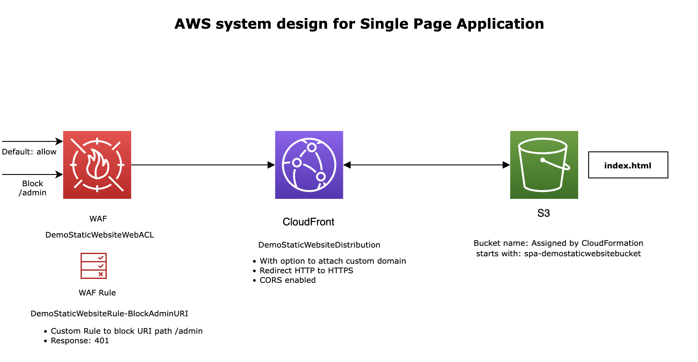

# Platform FTE Exercise

For creating a reusable SPA (Single Page Application) module, the technology chosen by me is AWS CDK.

The AWS infrastructure components used in the project are:

- S3 fo hosting static website. 
- Cloudfront CDN for delivery of the final content. 
  Though a S3 can be configured to host the SPA on a custom domain (one of the requirements), 
  Cloudfront was chosen to satisfy the requirements below:
      - SSL support
      - Using custom WAF rules
      - Support CORS use case 
- Additionally, cloudfront also ensures fast delivery of services across the globe using its edge locations. 
- Cloudfront does introduce a challenge of invalidating cache. One solution could be to invalidate cache on publishing new contents to the S3 bucket.



## Running the code

### Pre-requisites
- [aws credentials configured](https://docs.aws.amazon.com/cli/latest/userguide/cli-configure-files.html)
- [python3](https://realpython.com/installing-python/)
- pip3
- AWS CDK (requires Node.js and npm)
```shell
npm install -g aws-cdk
```

### To deploy the infrastructure 
```make deploy```

### To destroy the infrastructure deployed earlier
```make destroy```

### To clean local .venv files
```make clean```
